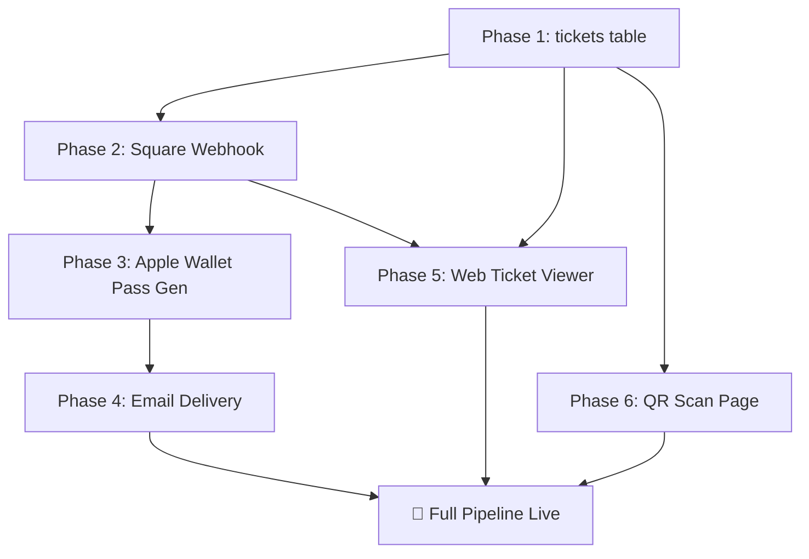

# 🎫 LMNL Ticketing System — Implementation Plan

> Synthesized from [ticket_fulfillment_plan.md](file:///Users/zestgxd/Documents/WEB-DEV/LMNL/.agent/ticket_fulfillment_plan.md), [user_journey_walkthrough.md](file:///Users/zestgxd/Documents/WEB-DEV/LMNL/.agent/user_journey_walkthrough.md), and [best_practices_guideline.md](file:///Users/zestgxd/Documents/WEB-DEV/LMNL/.agent/best_practices_guideline.md), cross-referenced against the live codebase.

---

## Current State (What Already Exists)

| ✅ Done | Detail |
|:--------|:-------|
| Square integration | SDK v44, sandbox + prod toggle, catalog linking |
| Supabase DB | `events` and `requests` tables live |
| Admin dashboard | `/admin` with request approval flow |
| Approve API | [approve-request.js](file:///Users/zestgxd/Documents/WEB-DEV/LMNL/api/approve-request.js) — creates Square checkout link + emails via Resend |
| Inventory check | [check-inventory.js](file:///Users/zestgxd/Documents/WEB-DEV/LMNL/api/check-inventory.js) — real-time stock from Square |
| Apple Wallet env vars | `APPLE_PASS_CERTIFICATE`, `APPLE_PASS_PASSWORD`, `APPLE_PASS_TYPE_IDENTIFIER`, `APPLE_TEAM_ID` already in `.env` |

## What Needs to Be Built

| ❌ Missing | Phase |
|:-----------|:------|
| `tickets` table in Supabase | Phase 1 |
| Square webhook listener (`api/square-webhook.js`) | Phase 2 |
| Apple Wallet `.pkpass` generator (`api/generate-pass.js`) | Phase 3 |
| Email delivery with pass attachment (update existing email flow) | Phase 4 |
| Web ticket viewer page (`/ticket/:ticketId`) | Phase 5 |
| Staff QR scan page (`/scan`) | Phase 6 |

---

## Phase 1: Database — `tickets` Table

**What:** Create the `tickets` table in Supabase to track every sold ticket and its scan state.

**Action:** Run this SQL in the Supabase SQL Editor:

```sql
CREATE TABLE tickets (
  id UUID PRIMARY KEY DEFAULT gen_random_uuid(),
  event_id UUID REFERENCES events(id) ON DELETE CASCADE,
  request_id UUID REFERENCES requests(id) ON DELETE SET NULL,
  square_order_id VARCHAR(255),
  customer_name VARCHAR(255) NOT NULL,
  customer_email VARCHAR(255) NOT NULL,
  qr_code_payload VARCHAR(255) UNIQUE NOT NULL,
  is_used BOOLEAN DEFAULT false,
  used_at TIMESTAMP WITH TIME ZONE,
  created_at TIMESTAMP WITH TIME ZONE DEFAULT now()
);
```

> [!IMPORTANT]
> `qr_code_payload` must be generated with high-entropy (crypto.randomUUID or similar), NOT a predictable sequential ID. This is per the best practices anti-counterfeiting spec.

**Prerequisites:** None — this is the foundation.

---

## Phase 2: Square Webhook — `api/square-webhook.js`

**What:** A serverless endpoint that Square calls automatically when a payment completes. This is the "handshake" from the user journey.

**Files to create:**
- `api/square-webhook.js`

**Logic flow:**
1. Receive POST from Square with `order.updated` event
2. Verify signature using `crypto.createHmac('sha256', webhookSecret)` against `X-Square-Signature` header
3. Check order state is `COMPLETED`
4. Match `line_items[].catalogObjectId` against `events.square_variation_id` in Supabase to identify the event
5. Extract customer info from the order
6. Generate a high-entropy `qr_code_payload` via `crypto.randomUUID()`
7. Insert a row into the `tickets` table
8. Trigger the ticket delivery pipeline (Phase 4)

**Idempotency (best practices):** Check if a ticket with the same `square_order_id` already exists before inserting — prevents duplicate tickets from retry webhooks.

> [!WARNING]
> You'll need to register the webhook URL in the Square Developer Dashboard under **Webhooks → Subscriptions**. The URL will be `https://lmnl.art/api/square-webhook` (or your Vercel preview URL for testing). You'll also need a new env var `SQUARE_WEBHOOK_SIGNATURE_KEY`.

---

## Phase 3: Apple Wallet Pass — `api/generate-pass.js`

**What:** Generate a `.pkpass` file (Apple Wallet format) for each ticket.

**Files to create:**
- `api/generate-pass.js`

**Dependencies to install:**
- `passkit-generator`

**Prerequisites:**
- Apple Developer Account with a **Pass Type ID** registered as `pass.art.lmnl`
- `.p12` certificate exported and base64-encoded into `APPLE_PASS_CERTIFICATE` env var
- Pass assets (icon, logo, background images) stored in `public/pass-assets/`

**Logic:**
1. Accept ticket + event data as input
2. Build pass with event name, location, date as primary/secondary fields
3. Embed the `qr_code_payload` as a QR barcode
4. Sign and return the buffer

---

## Phase 4: Ticket Delivery — Fulfillment Engine

**What:** The orchestrator that fires after webhook verification. Sends the branded confirmation email with the `.pkpass` attached + a fallback web link.

**Files to modify:**
- `api/square-webhook.js` (calls into this flow after ticket creation)

**New file (optional helper):**
- `api/_lib/fulfill-ticket.js` — shared fulfillment logic

**Email contents:**
- HTML branded template with event details
- `.pkpass` file attached for Apple users
- Fallback link: `https://lmnl.art/ticket/{ticket-id}` for all platforms

---

## Phase 5: Web Ticket Viewer — `/ticket/:ticketId`

**What:** A responsive web page that any ticket holder can open. Shows a live QR code rendered client-side, event details, and an "Add to Apple Wallet" button on iOS.

**Files to create:**
- `src/pages/Ticket.jsx`
- `src/pages/Ticket.css`

**Files to modify:**
- [App.jsx](file:///Users/zestgxd/Documents/WEB-DEV/LMNL/src/App.jsx) — add `<Route path="/ticket/:ticketId" element={<Ticket />} />`

**Behavior:**
- Fetches ticket data from Supabase by ID
- Renders QR code using existing `qrcode.react` dependency (already installed!)
- Conditionally shows "Add to Apple Wallet" button on iOS/Safari
- Displays "Ticket Used" state if `is_used === true`

---

## Phase 6: Staff QR Scan Page — `/scan`

**What:** A protected internal page for event staff to scan QR codes at the door.

**Files to create:**
- `src/pages/Scan.jsx`
- `src/pages/Scan.css`
- `api/verify-ticket.js` — API endpoint to look up + mark ticket as used

**Files to modify:**
- [App.jsx](file:///Users/zestgxd/Documents/WEB-DEV/LMNL/src/App.jsx) — add protected route

**Dependencies to install:**
- `jsqr` (or use native `BarcodeDetector` API with fallback)

**Behavior:**
1. Camera opens via `navigator.mediaDevices.getUserMedia`
2. Frames scanned for QR codes
3. On detection, POST to `api/verify-ticket.js` with the payload
4. API checks the `tickets` table:
   - Ticket not found → ❌ INVALID
   - `is_used === true` → ⚠️ ALREADY SCANNED (show `used_at` timestamp)
   - `is_used === false` → ✅ VALID, flip `is_used = true` and set `used_at = now()`
5. Display result with clear visual feedback (green/red/amber)

---

## Suggested Build Order



> [!NOTE]
> Phases 5 and 6 are independent of each other and can be built in parallel. Phase 4 depends on Phase 3 (pass generation) being ready.

---

## Questions Before We Start

1. **Do you have the Apple Developer certificates ready**, or should we skip Phase 3 for now and build the web-only flow first (Phases 1 → 2 → 4-email-only → 5 → 6)?
2. **Which phase do you want to start with?** I'd recommend Phase 1 (DB) since everything depends on it.
3. **Should the `/scan` page be admin-subdomain only**, matching the existing `showAdmin` pattern in App.jsx?
